# UWB技术文档

- [UWB技术文档](#uwb技术文档)
  - [UWB相关知识点](#uwb相关知识点)
    - [SSTWR测距法（单边双向测距法）](#sstwr测距法单边双向测距法)
    - [DSTWR测距法（双边双向测距法）](#dstwr测距法双边双向测距法)
    - [OWR测距法](#owr测距法)
      - [DLTDOA](#dltdoa)
      - [ULTDOA](#ultdoa)
    - [AOA角度测量](#aoa角度测量)
    - [TWR和TDOA区别](#twr和tdoa区别)
    - [动态会话时间同步（DSTS）](#动态会话时间同步dsts)
      - [简介](#简介)
      - [动静态的区别](#动静态的区别)
      - [STS加解密](#sts加解密)
      - [安全性示例：](#安全性示例)
    - [测距模式（Block）](#测距模式block)
    - [测距方案](#测距方案)
      - [基于竞争的测距（CAP）:](#基于竞争的测距cap)
      - [时间调度测距（CFP）:](#时间调度测距cfp)
      - [混合调度模式](#混合调度模式)
    - [测距阶段](#测距阶段)
      - [竞争测距模式](#竞争测距模式)
      - [时间调度模式](#时间调度模式)
    - [测距流程](#测距流程)
    - [数据传输阶段](#数据传输阶段)
      - [简述](#简述)
      - [DTPCM](#dtpcm)
  - [APDU](#apdu)
    - [SR1XX架构](#sr1xx架构)
    - [8054](#8054)
    - [8050交易流程](#8050交易流程)
    - [1E文件解析](#1e文件解析)
  - [FiRa](#fira)
    - [整体框架简介](#整体框架简介)
    - [静态STS通信流程](#静态sts通信流程)
    - [对等FiRa设备建立连接过程](#对等fira设备建立连接过程)
    - [FiRa Applet](#fira-applet)
      - [ADF（应用专用文件）](#adf应用专用文件)
      - [认证](#认证)
      - [RDS（测距数据集）](#rds测距数据集)
      - [OOB、安全通道和UWB会话](#oob安全通道和uwb会话)

UWB相关知识点
----------

### SSTWR测距法（单边双向测距法）

术语：

-   往返飞行时间 （TOF）

-   单边双向测距法（SSTWR）

-   双边双向测距法（DSTWR）

特点： 需要标签和基站同时具备发送和接收信号的能力， 计算各自发送和接收消息的时间间隔，从而实现标签和基站之间距离的测量。

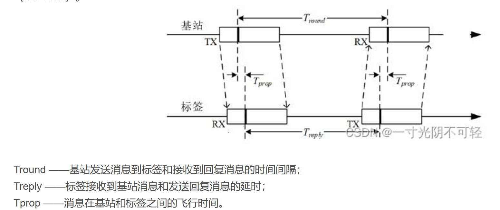

*图1: SSTWR单边双向测距原理示意图*

单边双向测量：基站与标签之间的飞行时间为(A到B的单次时间):

飞行时间包括装载数据、发送数据和接收3个时间。因此，测量距离理论上大于真实距离（真实距离仅通过发送数据时间速度计算）。

得到一组距离后，可以通过三边定位法确定标签的位置，至少需要3个基站，通过3个平面圆确定唯一的一个位置。

*图2: 三边定位法原理示意图*

注：实际上采用的是双圆+角度信息的方式确定唯一距离。

### DSTWR测距法（双边双向测距法）

*图3: DSTWR双边双向测距原理示意图*

DSTWR测距精度优于SSTWR。

参考：*Numerical and Experimental Evaluation of Error Estimation for TwoWay Ranging Methods*

时钟同步：

SSTWR：在单边双向测距中，由于两个设备可能使用不同的时钟源，因此它们之间的时钟可能不同步。这会导致测量距离时出现误差，因为每个设备都是基于自己的时钟来测量时间的

• DSTWR：双边双向测距通过使用两个往返时间测量来减少时钟不同步带来的误差。这种方法可以更准确地确定信号在空中的实际飞行时间，因为往返时间的测量可以抵消单向测量中的时钟偏差

• 误差补偿：

SSTWR：由于时钟不同步，SSTWR可能需要额外的补偿机制来校正测量误差，例如通过引入一个固定的延时或使用其他方法来估计时钟偏移

• DSTWR：DSTWR通过计算两个往返行程的时间，并使用特定的算法来消除时钟偏差的影响，从而减少误差。例如，通过将两个往返时间相乘然后减去发送和接收回复的时间乘积，可以解出信号在空中的传播时间

• 测距精度：

SSTWR：由于时钟不同步的问题，SSTWR的测距精度可能受到限制。

DSTWR：DSTWR由于采用了更复杂的误差补偿机制，通常能够提供更高的测距精度

### OWR测距法

OWR相比于TWR，更适合用来做定位：

-   OWR设计上更简单，单向数据传输减少了复杂度，能耗也更低。

-   OWR安全性更好，移动Tag可以不发送信号返回

-   OWR可通过多个Anchor的测距信息减少误差

-   TWR则更适合Tag和Anchor之间频繁通信的场景

**OWR通过多组信号的时间差确定距离（单向）。但在定位场景中，虽然Anchor和tag之间不需要同步，但Anchor之间需要进行同步时钟。**

#### DLTDOA

DLTDoA（Downlink Time Difference of Arrival）即下行时差到达，是一种用于确定移动设备位置的定位技术。在DLTDoA系统中，多个同步的固定设备（称为DTAnchors）向移动设备（称为DTTag或UTTag）发送信号。移动设备接收这些信号并测量信号到达的时间，通过这些时间测量值计算出到达时间差（TDoA），从而确定其位置。以下是DLTDoA技术的一些关键点：

1\. 定位原理：DLTDoA利用多个固定基站（DTAnchors）发送的信号到达移动设备的时间差来确定设备的位置。这种方法通常用于室内定位系统，因为它可以在GPS信号不佳的环境中提供精确的位置信息。

2\. 同步性：在DLTDoA系统中，**所有DTAnchors需要同步它们的时钟以确保时间测量的准确性**。

3\. 信号传输：DTAnchors广播信号，移动设备（DTTag）被动接收这些信号。这种方式的优点是不会暴露移动设备的位置，因为它只是接收信号而不发射信号。

4\. 时间测量：移动设备测量信号的接收时间，并使用这些时间戳来计算与每个DTAnchor之间的距离。

5\. 定位算法：通过测量至少三个DTAnchors的时间差，可以使用三角测量或超定系统来确定移动设备的位置。

6\. 网络结构：DLTDoA网络可能包含多个集群（clusters），每个集群由一个发起者DTAnchor（Initiator DTAnchor）和多个响应者DTAnchors（Responder DTAnchors）组成。

8\. 应用场景：DLTDoA适用于多种场景，包括室内导航、资产跟踪、安全监控等。

9\. 安全性：由于移动设备不需要发射信号，DLTDoA提供了一种相对安全的位置确定方式，因为它难以被未经授权的第三方追踪。

10\. 技术挑战：DLTDoA系统需要精确的时间同步和有效的算法来处理多径效应和信号衰减，这些都可能影响定位的准确性。

#### ULTDOA

ULTDoA（Uplink Time Difference of Arrival）即上行时差到达，是一种基于UWB（Ultra Wideband，超宽带）技术的定位方法，用于确定移动设备（如智能手机或标签）相对于固定锚点（Anchors）的位置。以下是ULTDoA技术的关键特点和过程：

1\. 定位过程：在ULTDoA中，移动设备（称为UTTag）定期发送信号（称为Blink UTMs或UTMs），这些信号被多个固定位置的锚点（称为UTAnchors）接收。

2\. 时间同步：锚点需要时间同步，以便准确测量信号到达的时间。这可以通过无线同步机制或有线同步机制实现。

3\. 信号传输：UTTag发送的信号被UTAnchors接收，每个UTAnchor记录接收到信号的时间戳（ToA，Time of Arrival）。

4\. 时间差计算：基于接收到的信号的时间戳，锚点可以计算出与UTTag之间的时间差（TDoA）。这些时间差可以用来估计UTTag的位置。

5\. 超定系统：为了准确确定UTTag的位置，通常需要至少三个UTAnchors接收到信号并计算出TDoA。

6\. 定位算法：使用超定算法（如三角测量或多元定位算法）处理多个TDoA测量值，以计算UTTag的精确位置。

7\. 随机窗口：为了避免UTTags之间的信号碰撞，可以引入随机窗口机制，使得每个UTTag在其配置的ULTDoA TX Interval内随机选择发送信号的时间。

8\. 传输间隔：UTTags根据可配置的ULTDoA TX Interval定期发送信号，这个间隔定义了UTTag可被定位的位置更新率。

9\. 安全性和可靠性：ULTDoA方法不保证通信的可靠性，碰撞确实可能发生，尤其是在参与ULTDoA会话的UWB设备数量增加时。

### AOA角度测量

天线阵列获取角度信息：

*图4: 天线阵列获取角度信息示意图*

AOA定位算法：

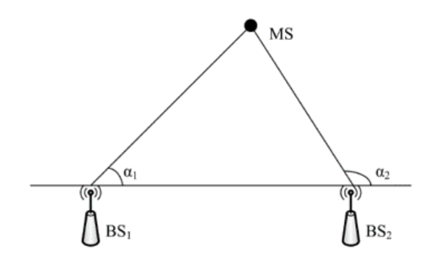

*图5: AOA定位算法原理图*

基站（BS）的位置已知，基站发送的信号到达两个被定位节点的到达角度分别为*α*1和*α*2。以基站为端点，两个到达角度为方向角的两条射线相交于接收节点，计算两条射线的交点即为被测节点的位置。

将基站BS1的坐标记作，BS2的坐标记作，被测节点坐标为。假设*α*1和*α*2均不为90°，则两射线的直线方程分别为：

式1.2中 ，

求解两条射线的交点坐标：

**利用角度信息将三维坐标映射到二维：**

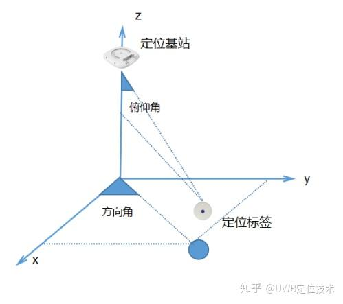

*图6: 利用角度信息将三维坐标映射到二维示意图*

1：首先假设处于同一平面，不论什么算法，计算x；

2 ：利用俯仰角构建直角三角形，计算实际映射坐标y (x无需转换) ：

或 :

若为的临边使用式(1.5)，若为的对边使用式(1.6)

在式(1.5)中

-   ±18°以内影响 ≤ 5%

-   **±25°以内影响 ≤ 10%** ：事实上10%的影响就开始比较明显了

-   **±31°以内影响 ≤ 15%**

-   **±36°以内影响 ≤ 20%**

-   ±41°以内影响 ≤ 25%

-   ±45°以内影响 ≤ 30%

-   ±50°以内影响 ≤ 36%

-   ±60°以内影响 ≤ 50%

需保证在能识别打电话场景的情况下，尽可能减少由角度测量误差带来的问题，特别是监测区外识别到监测区内的情况（大角度误差）

一方面由于当前角度测量值精度并不是很高，另一方面当角度值越高其对Y值的影响就越大，因此，对测量角度值范围压缩，从原来的\[-60,60\]修改为\[-41,41\]

### TWR和TDOA区别

-   TWR测距仅需一个锚点就可和TAG进行测距，而TDOA至少需要两个锚点才能和TAG进行测距

-   TWR在测距时锚点间、锚点和TAG间都无需进行时间同步，可以各自使用自己的时钟。如在闸机场景下，主/从锚点和TAG测距时，主锚点、从锚点和TAG三方都使用各种的时钟，相互之间都没有进行时钟同步。（注：不知为何，手机作为TAG时需要保证系统时间为当前时间才能测距，该BUG为手机端自身引起，可能当前时间和蓝牙或UWB的启动相关）

-   TWR在测距时需要知道对方是谁。这导致TWR-TAG需要对TWR-Anchor进行绑定，针对该TAG的测距将被限制在以绑定主Anchor为核心的UWB网络中。这对于需要和不同的UWB网络交互场景来说是致命的。

-   TDOA在测距时不需要知道对方是谁。这意味着TDOA-TAG可以同时和多个UWB网络进行交互。但也存在限制，如冲突碰撞、各UWB网络和TAG的一些关键配置得相同以保证他们能够通信等。

-   TDOA在测距时需要在锚点间进行时钟同步，我的理解是同一个UWB网络中的锚点需要进行时钟同步。UWB网络和TAG之间的时钟同步不是必须的，这涉及到了硬件的设计，暂不考虑。

-   在TDOA系统中添加更多的锚点可以提高定位精度和覆盖范围，而不会对现有设备造成太大影响，扩展性很好。

-   TDOA对于多路径效应的敏感度较低，因为反射或折射的信号将同时到达所有锚点，从而减少了多路径效应对定位精度的影响。

### 动态会话时间同步（DSTS）

#### 简介

在FiRa标准的规范中，将设备分为了Controller、Controlee两种类型（device\_type）；\
从设备的角色来分，又分为Initiator以及Responder两种（device\_role）。

*图7: FiRa设备类型和角色分类*

在FiRa MAC中的调度模式采用：time scheduled based ranging（基于时间调度的[*测距*](https://so.csdn.net/so/search?q=%E6%B5%8B%E8%B7%9D&spm=1001.2101.3001.7020)），测距设备由控制器进行调度，不同的设备在不同的时隙发送相对应的UWB消息，包含：测距帧（RFRAME）或测量报告。

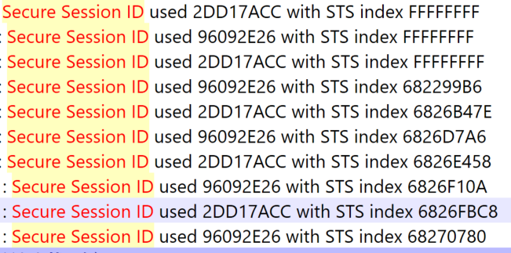

*图8: FiRa MAC基于时间调度的测距模式*

基于时间调度的模式下，FiRa中引入了测距块（ranging block）、测距轮（ranging round）以及测距时隙（slot）的概念。对于基于块的测距模式而言，首先要理解其构成框架：每个会话中的测距分为了多个块(Block)，在每个块内有分为若干测距轮（Ranging Round），而每个测距轮内又拆分为更小的测距时隙(Slot)单元。正常情况下，测距过程将在每个块的固定测距轮之内完成。

*图9: FiRa测距块、测距轮和时隙结构*

**UWB交易需要绑定测距来防止中继攻击，通过利用物理层的安全特性：精确的距离测量来检测潜在的安全危机。为了绑定测距，必须使用动态STS**。

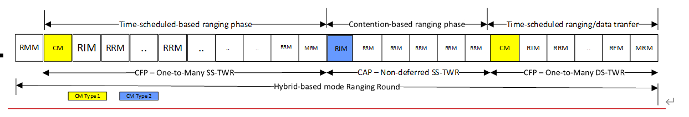

*图10: 动态STS防止中继攻击的安全机制*

DSTS在通信双方之间建立一个安全的会话，在通信开始时，动态STS通过一个安全的密钥交换过程生成一个会话密钥。这个会话密钥是随机生成的，并且只用于当前通信会话。动态STS要求通信双方在时间上进行精确同步，以确保数据包在预期的时间内被发送和接收。这有助于防止重放攻击。此外，在UWB等技术中，动态STS可以用来将测距（确定设备间的距离）与交易（如支付或数据交换）绑定在一起，确保交易的物理接近性和安全性。

#### 动静态的区别

从两种模式的定义中，我们可以知道，在静态STS中，对于每个[*测距*](https://so.csdn.net/so/search?q=%E6%B5%8B%E8%B7%9D&spm=1001.2101.3001.7020)轮（Ranging Round）的对应时隙编号的STS是相同的，这就允许接收方能够更加快速的实现与控制器的同步；而对于动态STS而言，安全性更高，对于时隙索引一直递增，也就是说，每个测距时隙的STS都不同，这是与静态STS最大的区别。

在动态STS模式下，会话密钥和子会话密钥都是动态生成的，并且可能在每次会话中都不同，从而提供更高的安全性。

在静态STS模式下，会话密钥可能是预先定义的，而子会话密钥可能不适用或使用不同的管理方式。

#### STS加解密

Session ID：唯一标识会话

STS index ：当前测距**槽slot**的STS索引值，用于STS同步和MAC有效载荷解密。

**控制器（Controller）**

在每个测距轮（ranging round）开始时，控制器生成一个新的STS索引。这个索引值是唯一的，并且在每个测距槽（ranging slot）中更新。

UWB设备特定密钥 = KDF(UWB根密钥, UWB ID)

短期密钥 = KDF(UWB设备特定密钥, STS索引, 随机值)

在发送数据消息（DM）时，控制器使用生成的短期密钥对数据进行加密。加密过程通常使用对称加密算法（如AES）。

加密数据 = AES加密(明文数据, 短期密钥)

控制器在DM的头部IE中包含STS索引，确保受控者可以正确解密数据。

Header IE

  VendorOUI   0x5A18FF
  ----------- --------------------
  Padding     0x0000000000000000
  SessionID   0x12345678
  STS索引     0x00000001

**受控者（Controlee）**

受控者在接收到控制器发送的控制消息（CM）或测距响应消息（RRM）时，提取其中的STS索引。

UWB设备特定密钥 = KDF(UWB根密钥, UWB ID)

短期密钥 = KDF(UWB设备特定密钥, STS索引, 随机值)

明文数据 = AES解密(加密数据, 短期密钥)

**密钥派生函数（KDF）**：控制器和受控者使用相同的密钥派生函数（KDF）和STS索引，结合其他安全参数（如UWB设备特定密钥、随机值等），生成短期密钥。

#### 安全性示例：

> **UWB 安全测距（如门禁系统）**

-   正常流程：设备 A 发送带时间戳 T1 的信号→设备 B 接收并记录接收时间 T2→计算时间差 ΔT=|T2-T1|→换算为距离。

-   攻击场景：若攻击者拦截信号并篡改 T1 为更小值（如 T1'=T1-Δt），ΔT' 会被误算为 ΔT-Δt，伪造 “更近” 的距离。

-   防御手段：通过 STS 加密时间戳，B 校验 T1 的完整性，若发现篡改则拒绝认证，防止非法开门。

### 测距模式（Block）

**1. 定义：**

基于块的模式是一种测距方法，其中测距活动被组织成一系列的“块”（Blocks）和“轮询”（Rounds）。每个块包含多个轮询，每个轮询又包含多个时隙（Slots），用于传输测距消息。

**2. 时间结构：**

Ranging Block：是测距的基本时间单位，包含一系列的轮询。

**Ranging Round：是块内的一个时间段，用于完成一个完整的测距周期。**

Slot：是轮询内的一个时间单位，用于传输一个完整的消息。

**3. 轮跳（Round Hopping）：**

轮跳是一种可选特性，允许设备在不同的块中跳转到不同的轮询，以改变测距的时序，这有助于减少碰撞和干扰。（**多个测距请求散步在一个块的不同轮中**）

**4. 跳频序列（Hopping Sequence）：**

当启用轮跳时，设备将遵循特定的跳频序列来确定下一个块中使用的轮询。这个序列通常由一个算法生成，可能涉及到加密技术来确保随机性和公平性。

**5. 块步进（Block Striding）：**

块步进是另一种可选特性，允许设备跳过一定数量的块，从而减少测距频率，降低功耗。

**6. 数据传输：**

在基于块的模式中，数据传输可以与测距过程同时进行，或者在一个独立的数据传输阶段进行。

**7. 控制器和控制对象的角色：**

控制器负责定义和控制测距过程，而控制对象则根据控制器的配置参与测距。

块是一个时间单位，由Slot组成，每个Slot可以承载一个数据包，可以是测距消息或应用数据。

### 测距方案

#### 基于竞争的测距（CAP）:

工作原理：在这种方式下，多个设备在相同的时间或频率资源上竞争发送测距信号的机会。设备随机选择发送测距信号的时间，如果两个设备同时发送，可能会发生冲突。

适用场景：适用于设备数量较少且分布较广的环境，或者在网络拓扑和设备活动模式难以预测的情况下。**DST\_MAC\_ADDRESS and NO\_OF\_CONTROLEES需要设置为0.此外，该方案下没有从机配置，所有配置设备都需要作为主机参与竞争。**

优点：实现相对简单，不需要复杂的时间同步或调度机制。

缺点：可能会因为信号冲突而导致测距失败或性能下降，特别是在设备密集的环境中。

#### 时间调度测距（CFP）:

工作原理：在这种方式下，所有的测距活动都由一个中心控制器（如主设备或网络协调器）进行调度。控制器为每个设备分配特定的时间槽进行测距信号的发送和接收。

适用场景：适用于设备数量较多且需要有序管理的环境，或者在网络拓扑和设备活动模式相对固定的情况下。

优点：通过时间调度减少了信号冲突的可能性，提高了测距的准确性和可靠性。

缺点：需要更复杂的调度算法和时间同步机制，可能增加了系统的复杂性和延迟。

总结：

基于竞争的测距更灵活，适合于设备较少或网络条件不稳定的环境。

时间调度测距更有序，适合于设备较多或需要精确控制测距过程的环境。

#### 混合调度模式

-   在HUS的每个测距轮询中，控制器在第一个测距时隙发送RMM，也称为控制消息类型3（Control Message Type 3）

-   控制器可以对**已知控制对象**使用时间调度模式进行测距

-   对于**未知控制对象**，控制器可以在CAP中使用竞争模式进行测距

<!-- -->

-   CAP阶段不需要发送CM（合并了）。

-   CM有多种类型，例如在数据传输阶段为DTPCM。

-   最好不要将CAP放在两个CFP之间，否则CAP的设备无法确定它是否会在后续CFP中被调用

### 测距阶段

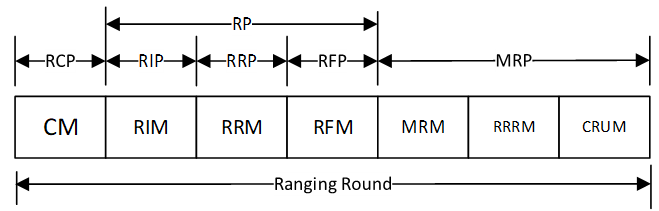

RP - 测距阶段应包括RIP、RRP，并且可能包含RFP。 RCP - 测距控制阶段，在这个阶段控制器发送控制消息（CM）。 RIP - 测距初始化阶段，在这个阶段发起器向响应器发送测距初始化消息（RIM）。 RRP - 测距响应阶段，在这个阶段响应器向发起器发送测距响应消息（RRM）。 RFP - 测距最终阶段，在这个阶段发起器向响应器发送测距最终消息（RFM），此阶段仅适用于DS-TWR测距。 MRP - 测量报告阶段，在此阶段参与的FiRa设备交换测距信息和相关服务信息。

CM - 控制消息是由控制器在测距轮询的第一个时隙中传输的。 RIM - 测距初始化消息是由发起器向响应器传输的。 RRM - 测距响应消息是由响应器向发起器传输的。 RFM - 测距最终消息是由发起器向响应器传输的。 MRM - 测量报告消息是由FiRa设备传输的，用于交换测量信息。 RRRM - 测距结果报告消息是由FiRa设备在MRP中传输的。 CRUM - 控制更新消息是由控制器在MRP中传输的。当存在时，这应该是测距轮询中的最后一个测距时隙。

每个测距轮询可能由一个RCP、一个RP和一个MRP组成，其中每个阶段可能由多个测距时隙组成。对于某些测距轮询的使用，可能可以合并一些阶段。当控制器和发起器在测距轮询中是同一个FiRa设备时，那么RCP和RIP可以合并为一个单独的阶段。

#### 竞争测距模式

竞争测距往往在不知道谁会参与的情况下使用，所以这种模式下的控制器和发起者通常为同一个设备。

-   **在SS-TWR测距方案中。**

首先，若控制器和发起者是同一个设备，那么CM和RIM将会合并（CM用于通知后续的CAP有多少Slot）；其次，SS-TWR方案没有RFM阶段；再次，若将RFRAME配置为SP1，那么RRM中将会携带MRM Type3（若是DS-TWR方案则携带MRM Type2）.

*图11: 竞争测距模式示意图*

如上图，每一个响应者在CAP Slot中选择一个回复RRM（这里可能会涉及冲突处理），需要保证每个slot被选择到的概率相当。

在该方案中，一个测距轮在RIM开始，在CAP的最后一个slot结束。（没有MRP，待确认）

-   **在DS-TWR测距方案中**

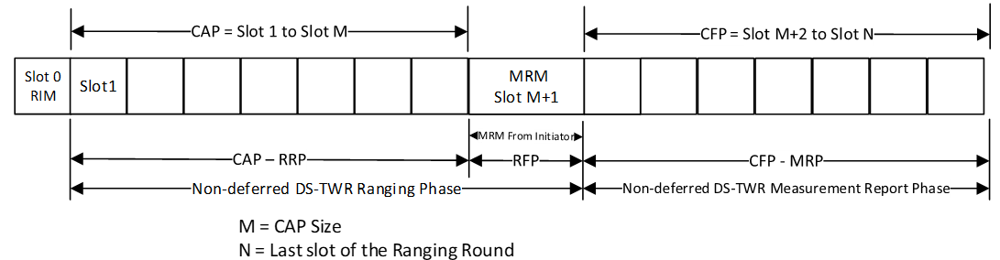

*图12: 调度测距模式示意图*

RRP后面会跟随RFP和MRP。和SS-TWR不同的是RRM中携带的是MRM Type2，RFM中则携带多个MRM Type1。MRM1中规定了每个响应器的回复时间，各响应器依次回复RRRM。

#### 时间调度模式

核心就是在RCP时传输CM，确定和调度测距行为。其余的参考竞争测距模式。常用在测距设备已知的场景，或是需要传输数据的场景？

在时间调度模式中，数据传输可以在测距轮询期间进行，也可以在专门的数据传输阶段进行。

### 测距流程

1.  **控制阶段（Control Phase, CP）:**

特点：这个阶段由控制器（Controller）发起，用于配置测距参数和调度设备。

使用的消息类型：控制消息（Control Message, CM）。

1.  **测距初始化阶段（Ranging Initiation Phase, RIP）:**

特点：初始化测距过程，通常由发起方（Initiator）发送测距初始化消息给响应方（Responder）。

使用的消息类型：测距初始化消息（Ranging Initiation Message, RIM）。

1.  **测距响应阶段（Ranging Response Phase, RRP）:**

特点：响应方接收到RIM后，回复测距响应消息，包含时间戳信息。

使用的消息类型：测距响应消息（Ranging Response Message, RRM）。

1.  **测距最终阶段（Ranging Final Phase, RFP） (仅用于DSTWR):**

特点：在双向测距（DoubleSided TwoWay Ranging, DSTWR）中，发起方接收到RRM后，发送最终测距消息以完成测距过程。

使用的消息类型：测距最终消息（Ranging Final Message, RFM）。

1.  **测量报告阶段（Measurement Report Phase, MRP）:**

特点：在测距过程结束后，设备交换测量结果，如往返时间（RoundTrip Time, RTT）等。

使用的消息类型：测量报告消息（Measurement Report Message, MRM）。

1.  **数据传输阶段（Data Transfer Phase）:**

特点：在测距的同时或之后，可以进行数据传输，以交换应用层数据。

使用的消息类型：数据消息（Data Message, DM）。

**ToF计算**: 如果使用的是单端双向测距（SSTWR），Initiator在接收到RRM后，会利用RRM中的时间戳信息和它自己的时间戳记录来计算往返时间（RoundTrip Time, ToF）。这个ToF是Initiator和Responder之间距离的两倍。

**距离计算**: 一旦Initiator计算出ToF，它可以通过以下公式计算出与Responder之间的实际距离： Distance=c×ToF2Distance=2c×ToF​ 其中 cc 是光速。

**距离信息的传递**: 在DSTWR中，Initiator可能会将计算出的距离信息通过RFM（Ranging Final Message）或其他形式的消息发送回Responder，从而使Responder也能获得距离信息。

**数据传输**: 在某些情况下，距离信息可能通过数据传输阶段（如使用DM Data Message）从Initiator传回Responder，或者通过其他通信协议进行交换。

**响应者的最终距离信息**: Responder最终通过接收到的RFM或通过其他方式获得的距离信息，结合它自己的测量和计算，得到与Initiator之间的距离

### 数据传输阶段

*图13: 数据传输阶段示意图*

#### 简述

数据传输阶段（Data Transfer Phase）允许在测距轮询之外分配时隙进行数据交换。

**1. 启动数据传输阶段：**

控制器（Controller）通过发送数据传输阶段控制消息（Data Transfer Phase Control Message, DTPCM）来启动数据传输阶段。DTPCM包含数据传输阶段管理列表（Data Transfer Phase Management List, DTPML），用于管理参与的FiRa设备和时隙分配。

**2. 数据传输阶段控制消息（DTPCM）：**

DTPCM是一个特殊的UWB消息，用于启动和管理数据传输阶段。它在CFP（ContentionFree Period）的第一个时隙中发送，并包含DTPML。

**3. 数据传输阶段管理列表（DTPML）：**

DTPML是DTPCM的一部分，列出了参与数据传输的每个FiRa设备的MAC地址，以及它们被分配的时隙信息。DTPML的每个条目都指定了一个设备可以发送数据的时隙。

**4. 时隙分配：**

控制器为每个参与数据传输的设备分配时隙。这些时隙用于发送数据消息（DM）。

**5. 数据消息（DM）：**

数据消息用于在分配的时隙中传输应用数据。DM可以承载MDSDU（MAC Service Data Unit）或其分段。

**6. 数据传输的效率：**

数据传输阶段允许在不进行测距活动的时隙中传输数据，这可以减少测距轮询的负载，并提高数据传输的效率。

**7. 数据传输的规则：**

每个控制设备至少需要读取DTPML中与其自身MAC地址匹配的条目，以及控制器的条目。控制器负责分配时隙，并且每个时隙只能分配给一个设备。如果控制器更新了DTPML，设备必须使用新的Slot Bitmap替换旧的。

#### DTPCM

  --------------------------------------------------------------------------
  Parameter          Size/bits   Notes
  ------------------ ----------- -------------------------------------------
  Data               8           Bit 0: 0b0 subsequent DTPCM
                                 
  Transfer Control               > 0b1 first DTPCM, starting data transfer
                                 
                                 Bit 1: 0b0 MAC address length 16bits
                                 
                                 > 0b1 MAC address length 64bits
                                 
                                 Bits 2 to 3: Slot Bitmap size
                                 
                                 > 00b00 : 8 ranging slots
                                 >
                                 > 00b01 : 16 ranging slots
                                 >
                                 > 00b10 : 32 ranging slots
                                 >
                                 > 00b11: 64 ranging slots
                                 
                                 Bits 4 to 7: RFU
  --------------------------------------------------------------------------

APDU
----

### SR1XX架构

*图14: SR1XX UWB芯片架构图*

Host应该为MCU，通过UCI接口控制UWB

### 8054

完成消费交易

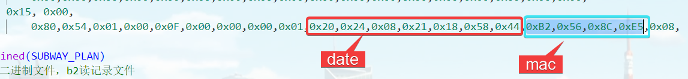

*图15: 8054交易流程图*

魅族钱包根据1E文件状态判断是否进行蓝牙切换，入站和出站都需要修改1E applet进出闸状态，入站不扣款，出站扣款，完成复合消费模拟

### 8050交易流程

*图16: 8050交易流程图*

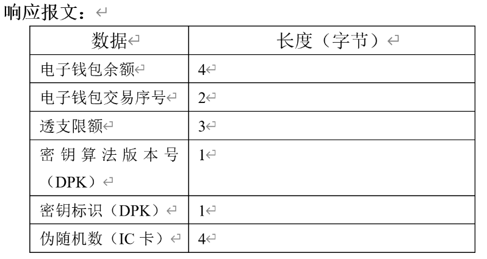

*图17: 8050详细交易流程图*

### 1E文件解析

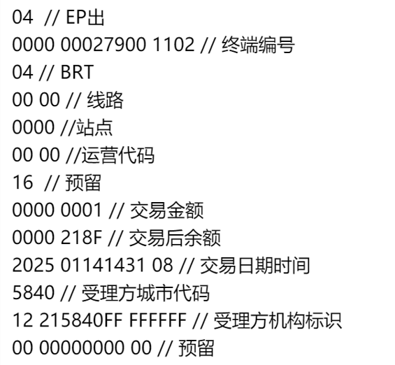

FiRa
----

###  整体框架简介

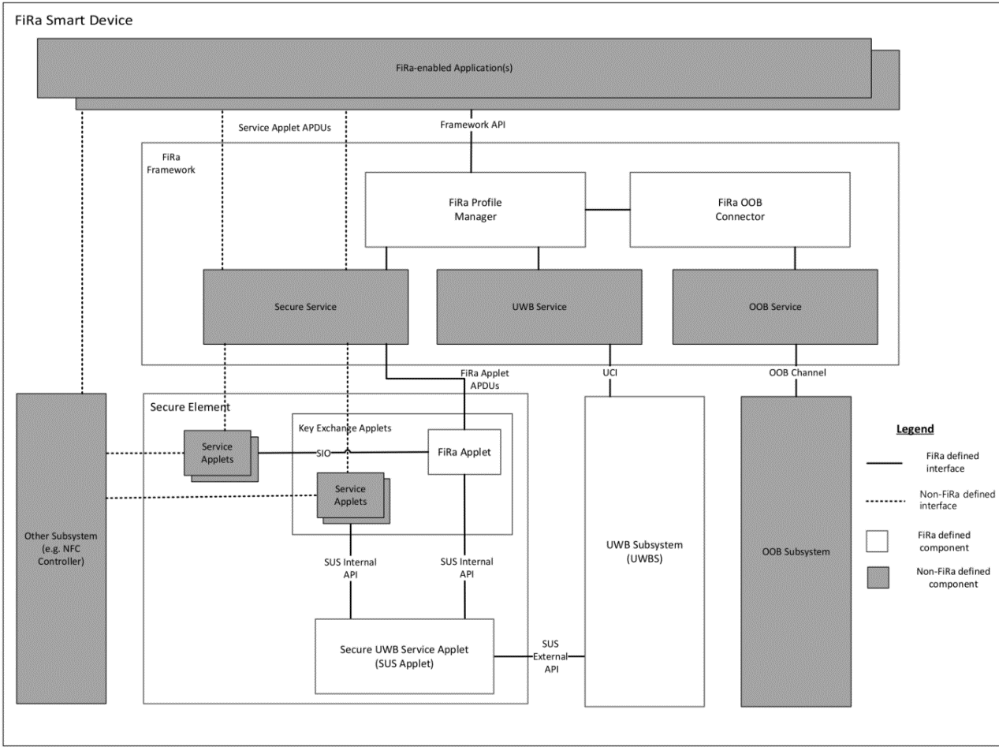

*图18: FiRa框架架构图*

-   **FiRa-enabled Application**：FiRa启用的应用程序，使用框架API来触发UWB会话的建立，并处理相关的事件和通知。

-   **FiRa Framework**：FiRa框架，是一组逻辑软件组件.

-   **FiRa Profile Manager**：FiRa配置文件管理器，管理FiRa设备上的配置文件。

-   **OOB Subsystem**：带外(OOB)子系统，硬件组件，负责建立OOB连接。

-   **Secure Component**：安全组件，通常是Secure Element (SE)，提供安全功能和存储。

-   **UWB Subsystem (UWBS)**：UWB子系统，硬件组件，实现FiRa PHY和MAC规范，与FiRa框架通过UCI接口交互。

-   **Framework API**：框架API，FiRa启用的应用程序通过这个API与FiRa框架交互。

-   **Service Applet**：服务Applet，运行在安全组件上的小程序，处理特定服务的事务。

-   **FiRa Applet**：FiRa小程序，包含在安全组件中，负责生成和管理UWB参数和会话数据。

-   **SUS Applet**：Secure UWB Service (SUS) Applet，与FiRa小程序交互，获取必要的数据以启用安全的UWB会话。

-   **UWB Service**：UWB服务，管理UWB会话，并与另一台FiRa设备的UWBS进行通信。

-   **FiRa OOB Connector**：FiRa带外连接器，软件组件，负责在FiRa设备之间建立OOB连接。

-   **Secure Service**：安全服务，提供与安全组件的接口，如Secure Element或TEE。

-   **UWB Command Interface (UCI)**：UWB命令接口，由UWB服务实现，用于配置UWB子系统。

-   **OOB Service**：OOB服务，由FiRa设备的原生操作系统实现，负责与OOB子系统进行接口。

### 静态STS通信流程

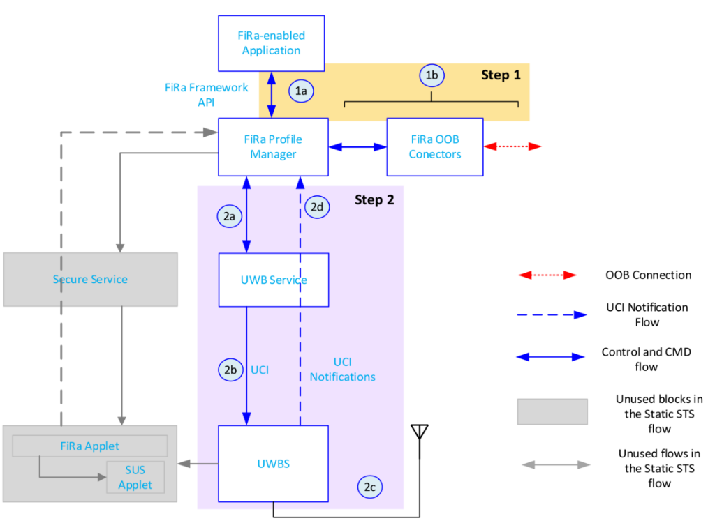

*图19: 静态STS通信流程图*

• **步骤 1**：FiRa启用的应用程序与FiRa框架交互，实例化一个FiRa配置文件，该配置文件将启用后续的带外（OOB）和UWB通信与另一个FiRa设备。

• **步骤 1a**：通过FiRa框架API，FiRa启用的应用程序请求FiRa框架（其FiRa配置文件管理器）实例化一个特定的FiRa配置文件。这个配置文件包括一些UWB配置参数（包括静态STS服务部署类型），并指定用于UWB会话配置参数协商的OOB发现技术类型。

• **步骤 1b**：一旦另一个FiRa设备进入OOB范围，FiRa框架的FiRa OOB连接器功能就与该FiRa设备建立一个OOB通道，通过该通道可以交换UWB配置信息。然后，FiRa OOB连接器触发FiRa配置文件管理器启动UWB会话建立的步骤。

• **步骤 2**：根据FiRa启用的应用程序提供的信息和通过OOB通道接收到的信息，FiRa框架通过UWB服务配置UWBS以进行静态STS操作。以下是步骤2的详细子步骤：

**步骤 2a**：FiRa配置文件管理器激活UWB服务，使FiRa框架能够与UWBS交互。

**步骤 2b**：UWB Service通过UCI命令处理UWBS的配置。UWB Service将测距数据集（RDS）传输到UWBS。

**步骤 2c**：两个UWBS启动UWB会话。UWB会话的确切开始时间由UWB Service确定。

**步骤 2d**：FiRa配置文件管理器通过UCI定义的通知定期接收UWB会话状态的通知。

### 对等FiRa设备建立连接过程

1\. OOB 通道的建立：首先，两个 FiRa 设备通过 OOB（Out-Of-Band）通道建立连接。OOB 通道可以是蓝牙低功耗（Bluetooth LE）、Wi-Fi 等非 UWB 通信技术。

2\. 安全通道的建立：在 OOB 通道建立之后，两个 FiRa 设备使用 FiRa 定义的 Secure Channel Protocol 1 或 Secure Channel Protocol 2 建立一个安全的通信通道。这个安全通道用于保护后续交换的数据，确保数据的安全性和完整性。

3\. UWB 会话数据和配置的交换：通过建立的安全通道，两个 FiRa Applet 交换 UWB 会话所需的数据和配置信息。这些信息包括但不限于 UWB Controlee Info、UWB Session Data、Ranging Data Set (RDS) 等。

4\. UWB 会话的建立：一旦交换了必要的 UWB 会话数据和配置信息，并且双方设备都同意并确认了这些信息，UWB 会话就得以建立。这个会话包括了测距、数据传输或两者的组合。

5\. RCM 的传输：UWB 会话建立之后，如果需要进行测距，Controller 设备将开始传输 Ranging Control Messages (RCM) 到 Controlee 设备。RCM 包含了进行测距所需的控制信息。

6\. 测距和数据传输：在 UWB 会话中，两个设备将使用超宽带技术进行测距和/或数据传输。测距可以采用多种方法，如 TDoA（Time Difference of Arrival）、SS-TWR（Single-Sided Two-Way Ranging）等。

总结来说，UWB 会话数据和配置的交换是在 OOB 通道上通过安全通道完成的。交换完成后，如果需要测距，UWB 会话将开始传输 RCM，以进行精确的距离测量。这个过程确保了两个设备可以在 UWB 会话中安全、有效地进行通信和测距。

### FiRa Applet

*图20: FiRa Applet核心功能图*

在UWB（超宽带）会话数据的生成过程中，FiRa Applet扮演了以下关键角色：

1\. 托管UWB参数：FiRa Applet存储和管理与UWB会话相关的参数，例如UWB设备的能力（UWB\_CAPABILITY）、偏好设置（UWB\_CONTROLEE\_PREFERENCE）、监管信息（UWB\_REGULATORY）和会话数据（UWB\_SESSION\_DATA）。

2\. 生成RDS：[]{#OLE_LINK1 .anchor}FiRa Applet负责生成Ranging Data Set（RDS），这是一组用于设置UWB会话的数据，其保密性、真实性和完整性需要得到保护。RDS通常包括UWB会话密钥、Session ID等信息。

3\. 安全通道建立：FiRa Applet通过与另一个FiRa设备建立安全通道（Secure Channel），交换UWB配置信息和RDS。这些安全通道可以是基于对称或非对称加密的，确保数据交换的安全性。

4\. 与SUS Applet交互：FiRa Applet与Secure UWB Service（SUS）Applet交互，将RDS传递给SUS Applet。SUS Applet进一步将这些数据传递给UWB Subsystem（UWBS），以便启动和维护UWB会话。

5\. 支持服务数据交换：在某些情况下，FiRa Applet还可以**存储和交换服务数据**（Service Data），这些数据由服务提供商（SP）定义，并需要在两个FiRa设备之间传输以实现完整的用例。

6\. 支持多会话管理：FiRa Applet可能支持与多个其他FiRa设备的并行会话，每个会话都与特定的**应用专用文件（Application Dedicated File, ADF）**相关联。这允许多个服务提供商通过同一个FiRa Applet与设备交互。

7\. 访问控制：FiRa Applet管理对UWB会话数据的访问权限，确保只有授权的设备和应用程序可以访问和修改这些数据。

8\. 会话终止：FiRa Applet还可以在需要时终止UWB会话，例如在交易完成或出现错误时。

总的来说，FiRa Applet在UWB会话数据的生成和管理过程中起到了核心作用，确保了UWB会话的安全性、可靠性和灵活性。

#### ADF（应用专用文件）

用于实现个性化服务，允许不同的服务提供商（Service Provider）在 FiRa 设备上部署和存储特定于应用的数据和配置。

**数据隔离**：每个 ADF 都有一个唯一的标识符（OID），并且可以存储与特定服务或应用相关的数据。这种隔离确保了不同服务之间的数据独立性。

UWB**测距根密钥**在ADF中被配置。它应为128或256位长。派生密钥的长度将与UWB测距根密钥相同。

如果ADF通过**SELECT ADF**被选中，它应使用它被配置的SC1或SC2密钥，而不管是否存在基础密钥。

**多服务支持**：一个FiRa设备可以支持多个Service Applets，每个Service Applet可以关联一个或多个ADF。选择特定的ADF可能会触发与该ADF关联的Service Applet的激活。

ADF可以用于存储与RDS相关的配置参数或密钥材料，这些参数或密钥材料在RDS生成过程中可能会用到

**支持的服务类型：**

物理访问控制服务（Physical Access Control Services, PACS）：使用 UWB 技术进行安全测距，以控制对物理位置的访问。

安全支付服务：利用 UWB 技术进行安全支付交易。

智能交通系统（Intelligent Transportation Systems, ITS）：使用 UWB 进行车辆定位和交通管理。

智能家居和物联网设备（Smart Home and IoT devices）：通过 UWB 技术进行设备间的安全通信和控制。

#### 认证

确保只有授权的实体可以访问和操作ADF。

-   **生成挑战码**：在执行安全操作时，FiRa Applet生成一个挑战码（Challenge），并将其发送给请求者。

-   **生成响应**：请求者使用自己的密钥（如对称密钥或私钥）对挑战码进行加密，生成响应（Response）。

-   **发送响应**：请求者将生成的响应发送回FiRa Applet。

-   **验证响应**：FiRa Applet使用相同的密钥对响应进行解密，验证响应是否正确。如果响应正确，认证成功；否则，认证失败。

-   **建立安全通道**：认证成功后，双方使用生成的会话密钥（Session Key）建立安全通道，确保后续的数据交换在安全的环境中进行。**会话秘钥用于安全通道的建立和维护**

#### RDS（测距数据集）

建立安全连接后，FiRa Applet负责生成Ranging Data Set

0xC0：UWB 会话密钥，长度为 16 或 32 字节，是强制性的。

0xCF：UWB 会话 ID 或 UWB 子会话 ID，是强制性的。

#### OOB、安全通道和UWB会话

OOB 信道负责传输建立安全通道所需的控制信息和数据，例如密钥交换、认证数据等。此外，OOB还将作为安全通道通信的底层无线技术。安全通道本身则是一种协议和传输机制。

**安全通道和UWB会话关系如下：**

**先决条件**：在某些情况下，建立安全通道可能是建立 UWB 会话的先决条件。这是因为在进行测距或数据传输之前，设备需要确保通信的安全性和双方的身份。

**密钥使用**：安全通道建立过程中交换的密钥（如 UWB 会话密钥）可以用于加密 UWB 会话中传输的数据，确保数据的安全性。

**服务数据交换**：安全通道还可以用于交换服务数据，这些数据是实现特定用例（如物理访问控制、支付等）所必需的。

建立安全通道是为了确保后续 UWB 会话的安全性和可靠性，但它本身并不是 UWB 会话的一部分。安全通道的建立是为 UWB 会话提供一个安全的环境，使得在会话中进行的测距和数据传输都是安全的。UWBS 通过与 FiRa Applet 的交互获取必要的会话参数（如 UWB 会话密钥、测距数据集 RDS 等），然后将这些参数用于 UWB 会话的建立和管理。

 {#section-4 .ListParagraph}
