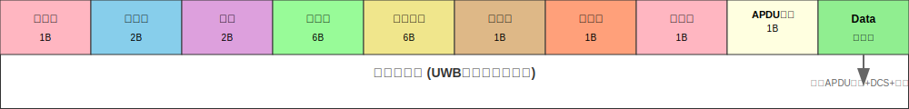

# UWB读卡器控制协议

本文档详细描述了UWB与Reader之间的通信协议规范。

## 0 版本信息

| 名称 | 版本 | 日期 | 作者 | 修订记录 |
|------|------|------|------|----------|
| Reader Control Protocol | v1.0 | 2025-03-24 | Kewei@Qilang² | init |
| Reader Control Protocol | v1.1 | 2025-04-16 | Kewei@Qilang² | update |
| Reader Control Protocol | v1.2 | 2025-05-23 | Kewei@Qilang² | update |

## 1 协议概述

本协议定义了UWB与Reader之间的通信规范，包括数据帧格式、命令定义、交互流程等内容。协议采用串口通信方式，支持双向数据传输和状态反馈。

## 2 通信参数

| 参数 | 值 | 说明 |
|------|----|----- |
| **波特率** | 460800 bps | 固定波特率 |
| **数据位** | 8位 | 数据位长度 |
| **停止位** | 1位 | 停止位设置 |
| **校验位** | 无 | 校验位设置 |
| **流控制** | 无 | 硬件/软件流控 |

## 3 数据帧格式

每个数据帧由以下部分组成：

| 字段 | 长度 | 值 | 说明 |
|------|------|----|----- |
| **起始位** | 1字节 | 0x00 | 固定起始标识 |
| **前导码** | 2字节 | 0x00, 0xFF | 固定前导序列 |
| **长度** | 2字节 | 0xXX, 0xXX | 除起始位/前导码/长度/DCS/结束位外的总长度 |
| **源地址** | 6字节 | 见地址定义 | 发送方地址 |
| **目标地址** | 6字节 | 见地址定义 | 接收方地址 |
| **序列号** | 1字节 | 0x00-0xFF | 指示当前交互序列，每次+1 |
| **命令字** | 1字节 | 见命令定义 | 不同的命令字指示当前阶段 |
| **状态位** | 1字节 | 0x00/0x01 | 标识当前交互状态，0：成功，1：失败 |
| **APDU数量** | 1字节 | 0x00-0xFF | 标识数据域中APDU的数量 |
| **数据域** | 变长 | - | 存储APDU数据 |
| **DCS** | 1字节 | 校验值 | 数据校验码 |
| **结束位** | 1字节 | 0x00 | 固定结束标识 |

### 数据帧结构图



> **注意**：DCS和结束位是数据域的一部分，拼接在apdu数据末尾

- 地址定义

| 设备类型 | 地址格式 | 说明 |
|----------|----------|----- |
| **UWB设备** | `06FFFFFFFFFF` | UWB标签/锚点地址 |
| **Reader设备** | `05FFFFFFFFFF` | 读卡器设备地址 |

- 数据域格式

数据域存储APDU数据，格式如下：

```
+----------+----------+----------+-----+----------+----------+------+----------+
| APDU长度1| APDU数据1| APDU长度2| ... | APDU长度N| APDU数据N|  DCS   |  结束位  |
| (2字节)  | (变长)   | (2字节)  | ... | (2字节)  | (变长)   | (1字节) | (1字节) |
+----------+----------+----------+-----+----------+----------+------+----------+
```

> **注意**：
> - 数据域最后两个字节为DCS+结束位0x00，提取APDU时需要剔除
> - Length和APDU长度都是小端存储，若长度为0x15，存储为[0x15, 0x00]

## 4 命令字定义

### UWB → Reader 命令

| 命令码 | 操作 | 说明 |
|--------|------|------|
| **0xC1** | 初始化请求 | 请求读卡APDU（可选项，若UWB没有预存读卡APDU时发送） |
| **0xC2** | 通用APDU | PHONE返回响应APDU直接发往Reader |
| **0xC3** | 特殊APDU | PHONE返回响应APDU处理后发往Reader |
| **0xC4** | Time_stamp | UWB向Reader请求时间戳 |

### Reader → UWB 命令

| 命令码 | 操作 | 说明 |
|--------|------|------|
| **0xC1** | 初始化响应 | 发送读卡APDU（可选，UWB发送C1请求时发送） |
| **0xC2** | 通用APDU | UWB收到APDU将直接发送到PHONE |
| **0xC3** | 特殊APDU | UWB收到APDU需要额外处理才能发送到PHONE |
| **0xC4** | Time_stamp | Reader向UWB响应时间戳 |


> **注意**：
> 1.如无特殊要求,C1/C3可忽略
> 2.HALT为C2命令中发送长度为1的APDU数组[0x00].
> 3.收到时间戳请求判断命令为0xC4即可.
> 4.发送时间戳为4字节16进制,小端存储.如:
    ```
    00 00 FF 14 00 05 FF FF FF FF FF 06 FF FF FF FF FF 01 C4 00 01 68 F6 0A DB F6 00
    0x68F60ADB = 1,760,955,099 (2025-10-20 18:11:39).
    ```

## 5 消息示例

### 帧结构示例

| 字段 | 十六进制值 | 说明 |
|------|------------|------|
| **起始位** | `00` | 固定起始标识 |
| **前导码** | `00 FF` | 固定前导序列 |
| **长度** | `15 00` | 小端存储，实际长度0x0015=21字节 |
| **源地址** | `05 FF FF FF FF FF` | Reader设备地址 |
| **目标地址** | `06 FF FF FF FF FF` | UWB设备地址 |
| **序列号** | `01` | 当前交互序列号 |
| **命令字** | `C2` | 通用APDU命令 |
| **状态位** | `00` | 成功状态 |
| **APDU数量** | `01` | 包含1条APDU |
| **数据域** | `05 00 A4 04 00 08 A0` | APDU数据内容 |
| **DCS** | `XX` | 数据校验码（计算得出） |
| **结束位** | `00` | 固定结束标识 |


### APDU交互示例

| 序号 | 消息内容 | 说明 |
|------|----------|------|
| 1 | `0A0D0000 A4040008 A0000006 32010105 050000B0 95001E05 0000B097 003C0500 805C0502 10050000 B201D480 050000B2 01C41705 0000B201 F4300500 00B202F4 30050000 B203F430 050000B2 04F430` | 读卡APDU to Phone |
| 2 | `0A3A006F 368408A0 00000632 010105A5 269F0802 00309F0C 1E022158 40FFFFFF FF020103 10487049` | Phone返回响应APDU |
| 3 | `0000FF31 0206FFFF FFFFFF05 FFFFFFFF FF47C200 0A3A006F 368408A0 00000632 010105A5 269F0802` | UWB转发响应 to Reader |
| 4 | `0000FF5A 0005FFFF FFFFFF06 FFFFFFFF FF2AC200 02110080 5003020B 01000000 00040900 0100010F 350080DC 00F03003 00000409 00010001 04000000 00000015 00000000 00002190 20250512 16303158 40122158 40FFFFFF FF000000 00000042 00` | Reader下发交易APDU |

## 6 交互流程


*图：UWB设备与手机、读卡器之间的完整交互时序*

!!! info "📋 时序图关键信息"
    
    ### 🔍 交互流程要点
    
    1. **预读阶段**：UWB在读卡区预读卡片信息

    2. **数据交换**：为降低交易耗时，应减少WRITE AREA中交互轮次,如步骤6中合并发送多条apdu，而不是单条多次发送。
    
    ### ⚠️ 错误处理机制

    - 若步骤4、8、12、14失败，UWB将流程回退至步骤3

    - 若步骤4、8、12失败，Reader需重新校验新的卡信息，防止二次扣费，若User已经扣费直接发HALT，结束交易。
  
    - 若步骤6、10失败，UWB将流程回退至步骤5

---


*图：UWB设备交互流程*


## 7 🔐DCS计算

DCS（Data Check Sum）是数据校验码，计算方法如下：

**除Header/Preamble及Length外所有字节的累加和需要为0**

```
DCS(05FFFFFFFFFF06FFFFFFFFFF39D100011500805401000F000019A82025031715145821FFD442081C)=0x00
```

## 8 ⚠️注意事项

### 数据处理
1. **DCS错误处理**：如果DCS错误，Reader应忽略该数据帧
2. **超时处理**：Reader返回数据需要在500ms以内，超时UWB将发起重试
3. **字节序**：Length和APDU长度都使用小端存储
4. **数据提取**：从数据域提取APDU时需要剔除最后的DCS+结束位

### 性能优化
1. **减少交互**：合并发送多条APDU，而不是单条多次发送
2. **错误恢复**：实现合理的重试和回退机制
3. **状态管理**：正确处理各种异常状态

## 🔗 相关文档

- [快速开始指南](../guide/quick-start.md)

---

*本协议文档持续更新，请以最新版本为准。如有疑问，请联系技术支持。*